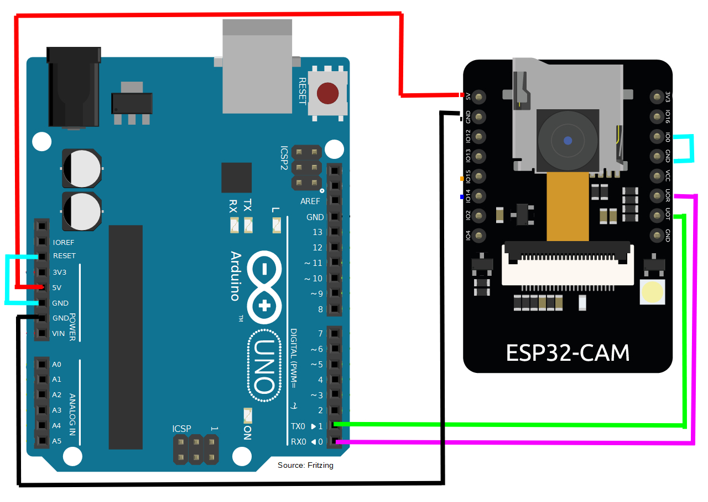
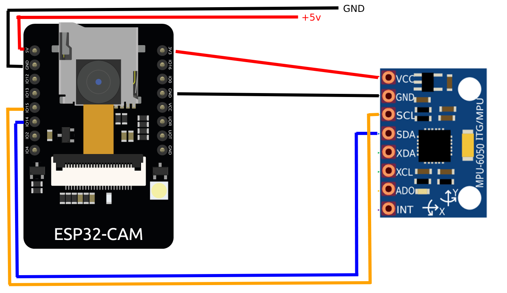
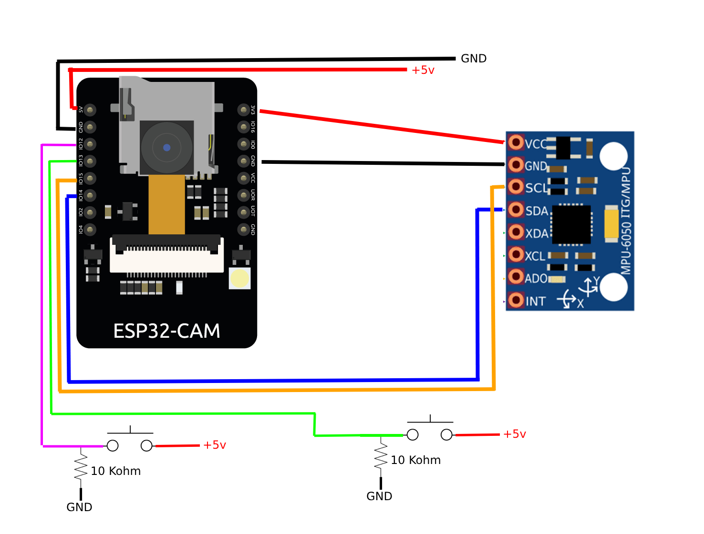

# Air Mouse with ESP32

This project uses an ESP32 to create a wireless air mouse. \
The ESP32 reads gyroscope data and translates it into mouse movements and clicks.

## Demo
Gyroscope attached to finger:

<video width="320" height="240" controls>
  <source src="./images/VID_20240310_160847.mp4" type="video/mp4">
</video>

Gyroscope attached to arm:

<video width="320" height="240" controls>
  <source src="./images/PXL_20240310_145648901.mp4" type="video/mp4">
</video>

## Main Components

- **ESP32**: The main controller that reads data from the gyroscope and sends mouse commands over Bluetooth, I used a ESP32CAM and it work, you can change with others ESP32 but they need to have Bluetooth 
- **Gyroscope(MPU6050)**: A device that measures the orientation of the ESP32. The data from the gyroscope is used to control the movement of the mouse cursor.
- **Buttons**: Two buttons are used to simulate left and right mouse clicks, I have created 2 diy buttons using aluminium foil and a cable

## Main Files

- main.cpp: This is the main file of the project. It initializes the ESP32, reads data from the gyroscope, and sends mouse commands over Bluetooth.
- reset.ino: This Arduino sketch is used to reset the ESP32.

## How It Works

The ESP32 continuously reads data from the gyroscope in the `loop()` function in main.cpp. The gyroscope data is then translated into mouse movements and clicks. The mouse movements are sent over Bluetooth using the `bleMouse.move()` function, and the mouse clicks are sent using the `bleMouse.click()` function.

In my version of the buttons the foil ring on the thum is attached to + 5V, and the other 2 rings are attached to the arduino input to simulate a button when the thums touches the other finger

## Wiring diagrams
### For flashing the esp32:

### For move only the mouse without buttons:

### For move only the mouse with buttons:

